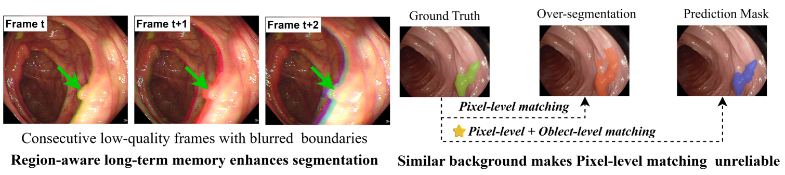
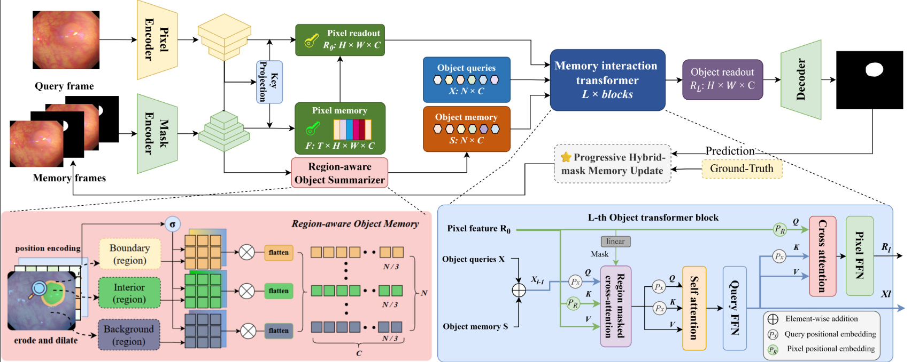
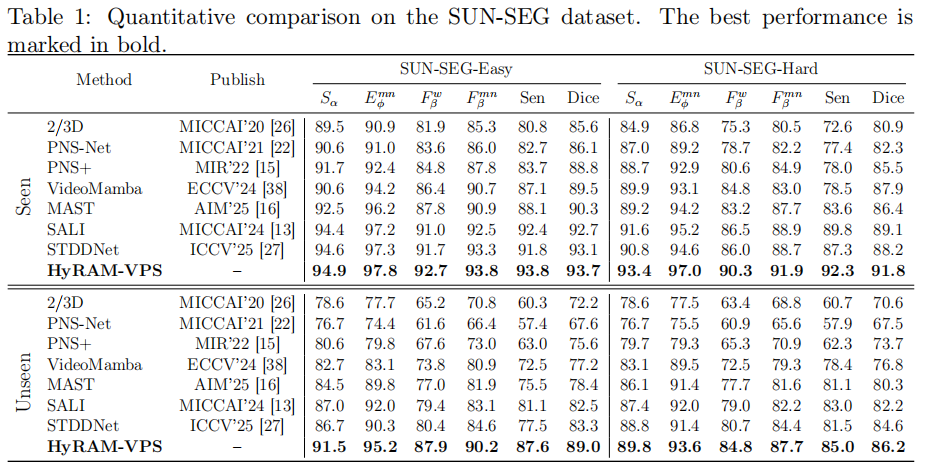
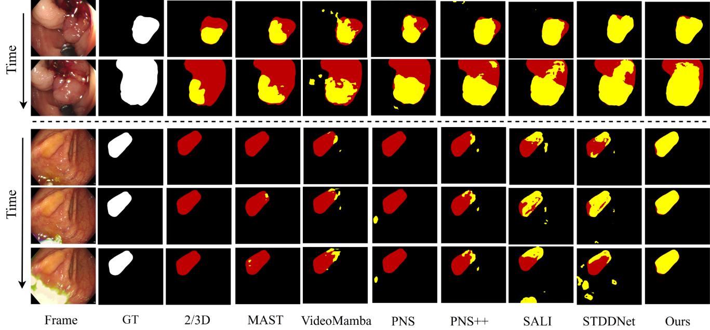
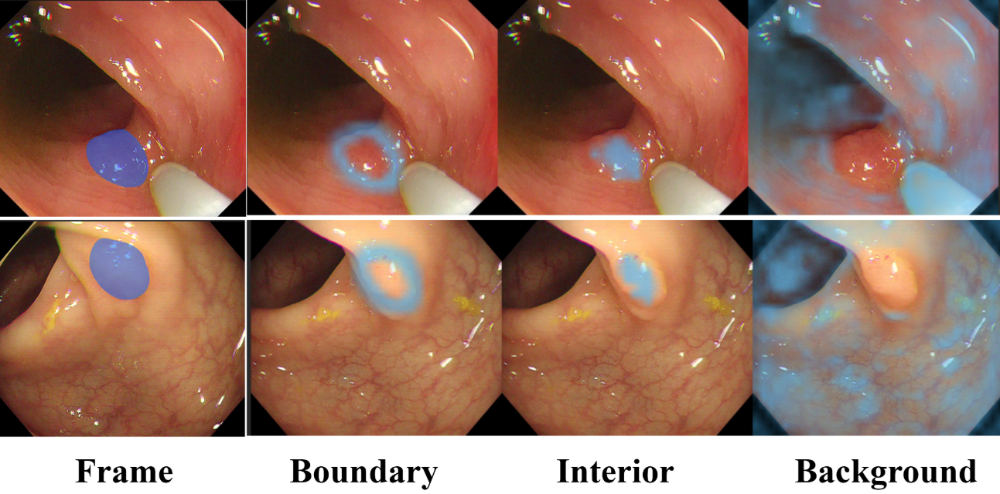
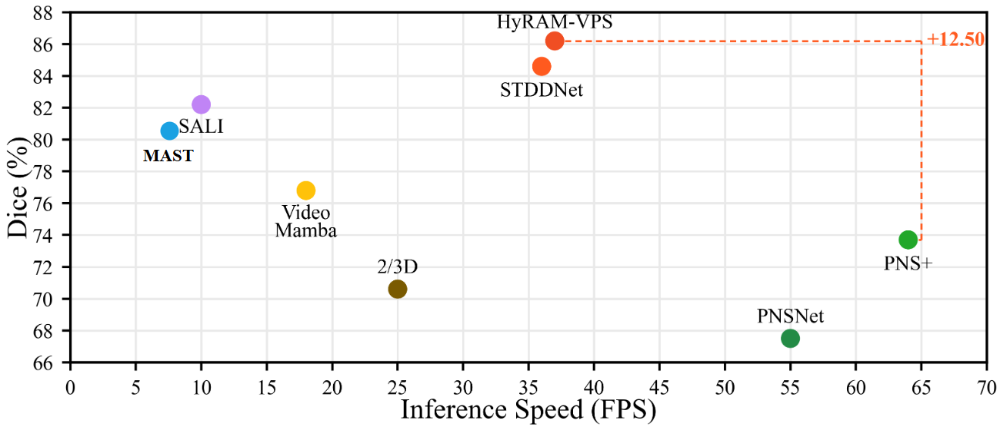

<div align="center">

# HyRAM-VPS

### Hybrid Memory Updating and Region-Aware Memory for Video Polyp Segmentation

<p align="center">
  
</p>


## Overview

HyRAM-VPS is an online framework for video polyp segmentation (VPS) in colonoscopy videos. Existing memory-based VPS methods commonly use pixel-level correspondence alone, which can mismatch visually similar mucosa, specular highlights, bubbles, and uncertain boundaries. In addition, directly writing predicted masks into memory can propagate errors across a sequence.

HyRAM-VPS couples high-resolution pixel memory with a region-aware object memory. Each memory mask is partitioned online into boundary, interior, and background regions using morphological operations, so no additional boundary annotations are required. A Memory Interaction Transformer exchanges information between dense pixel readouts and region-specific object tokens through region-separated masked cross-attention and reverse cross-attention. During training, progressive hybrid-mask memory updating gradually shifts memory writes from ground-truth masks to predicted masks to reduce training-inference mismatch.

On SUN-SEG, HyRAM-VPS achieves the best results in all 24 reported dataset-metric combinations. It obtains 86.2% Dice and 37 FPS on the challenging SUN-SEG Unseen-Hard subset.

## Method

<p align="center">
  
</p>

Overview of HyRAM-VPS. Given a query frame and previously segmented memory frames, the pixel encoder and mask encoder generate the key--value pixel memory $F$. A region-aware object summarizer partitions each memory mask into boundary, interior, and background regions, and produces the object-memory tokens $S$. Pixel matching retrieves an initial query-frame readout $R_0$. The memory interaction transformer updates object queries by region-separated masked cross-attention, integrates them with self-attention, and injects the resulting object semantics back into the pixel readout through reverse cross-attention. After $L$ blocks, the refined readout $R_L$ is decoded into the predicted mask.

## Experimental Results

### Performance on SUN-SEG

<p align="center">
  
</p>

The model ranks first for every reported metric across the four SUN-SEG test settings. On Unseen-Hard, it improves Dice by 1.6 percentage points over the second-best reported method while maintaining real-time inference.

<p align="center">
  
</p>

<p align="center">
  
  
</p>


## Usage

### Prerequisites

- Python 3.10+
- PyTorch and TorchVision compatible with the installed CUDA version
- Linux, an NVIDIA GPU, and CUDA for training and evaluation

### Installation

```bash
pip install -r requirement.txt
```

### Dataset preparation

Obtain the SUN-SEG dataset from the [PNS+ data description](https://github.com/GewelsJI/VPS/blob/main/docs/DATA_DESCRIPTION.md), then arrange it as follows:

```text
SUN-SEG/
├── TrainDataset/
│   ├── Frame/<video>/*.jpg
│   └── GT/<video>/*.png
├── TestEasyDataset/
│   ├── Seen/{Frame,GT}/<video>/*
│   └── Unseen/{Frame,GT}/<video>/*
└── TestHardDataset/
    ├── Seen/{Frame,GT}/<video>/*
    └── Unseen/{Frame,GT}/<video>/*
```

Before training, verify that frames and masks are paired correctly:

```bash
python scripts/data/check_sunseg.py --root /path/to/SUN-SEG
```

### Training

```bash
torchrun --nproc_per_node=1 train.py \
  --config-name train_sunseg_config.yaml \
  exp_id=sunseg \
  main_training.num_iterations=50000 \
  main_training.learning_rate=5e-5 \
  main_training.seq_length=8 \
  main_training.num_ref_frames=3 \
  main_training.batch_size=1 \
  main_training.crop_size=[480,480] \
  main_training.train_num_points=12544 \
  main_training.gt_memory_start_prob=0.7 \
  main_training.gt_memory_end_prob=0.2 \
  main_training.gt_memory_decay_iters=30000
```

### Testing

```bash
for split in sunseg-easy-seen sunseg-easy-unseen sunseg-hard-seen sunseg-hard-unseen; 
do
    PYTHONPATH=/path/HyRAM-VPS \
    torchrun --nproc_per_node=1 test.py \
    --config-name eval_sunseg_config \
    weights=output/sunseg/sunseg_main_training_last.pth \
    dataset=$split \
    size=480 \
    mem_every=10 \
    output_dir=output/$split
done
```

**Evaluate** the generated prediction maps with:

```bash
python evaluator.py --splits all --n_workers 0
```

# Acknowledgement

Our work builds upon the excellent foundational research of [PNS+](https://github.com/GewelsJI/VPS) and [Cutie](https://github.com/hkchengrex/Cutie). We thank the authors for their awesome works and publicly available codes.
